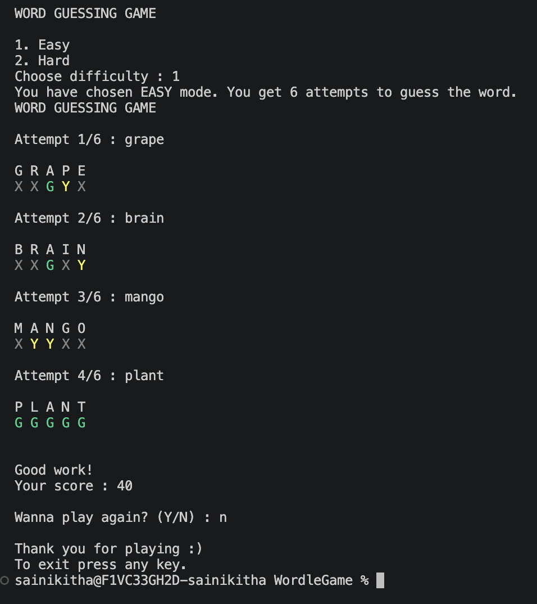
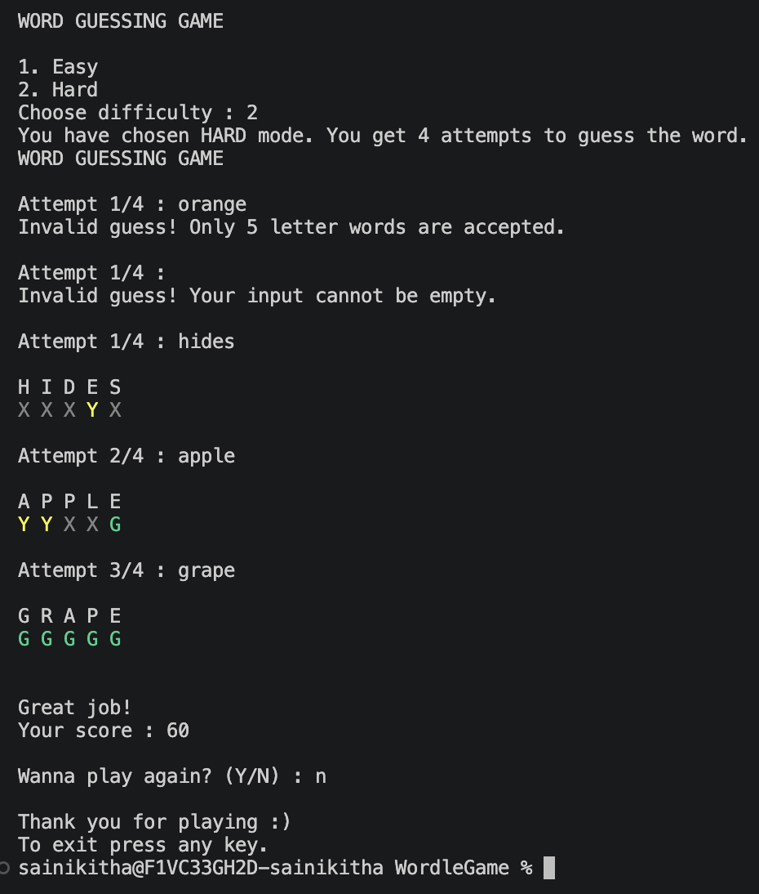

# Word Guessing Game

A console-based word guessing game inspired by Wordle, built using C# and Object-Oriented Programming concepts.

The system randomly selects a hidden 5-letter word and the player has limited attempts to guess it correctly.

---

# Problem Statement

The goal of this project is to build a console-based word guessing game like Wordle using C# and OOP concepts.

The game:
- randomly selects a hidden 5-letter word
- gives limited attempts to the player
- generates feedback after every guess
- validates user input using exception handling

Feedback Rules:

| Symbol | Meaning |
|---|---|
| G | Correct letter in correct position |
| Y | Correct letter but wrong position |
| X | Letter not present in the hidden word |

---

# Core Logic (Pseudocode)

## 1. Start Game
- Random hidden word selected
- Initialize attempt counter
- Player starts guessing

---

## 2. Validate User Input

Checks performed:
- empty input
- less than 5 letters
- greater than 5 letters
- numbers present
- special characters present
- duplicate guess

If invalid:
- throw custom exception
- show proper error message
- do not reduce attempts

---

## 3. Generate Feedback

For each letter:
- correct letter + correct position → `G`
- correct letter + wrong position → `Y`
- letter not present → `X`

---

## 4. Win Condition
- all letters become `G`
- game ends immediately
- score displayed

---

## 5. Lose Condition
- attempts exhausted
- hidden word revealed

---

## 6. Replay Option
- player can restart the game

---

# Features Implemented

## Basic Features
- Random hidden word generation
- Guess validation
- Feedback generation
- Win/Lose conditions
- Attempt tracking

---

## Bonus Features
- Replay option
- Difficulty levels
- Score system
- Colored console output
- Duplicate guess prevention

---

# Difficulty Levels

| Mode | Attempts |
|---|---|
| Easy | 6 |
| Hard | 4 |

---

# Score System

| Attempts Used | Score |
|---|---|
| 1 | 100 |
| 2 | 80 |
| 3 | 60 |
| 4 | 40 |
| 5 | 20 |
| 6 | 0 |

---

# Concepts Used

- Classes and Objects
- Encapsulation
- Constructors
- Methods
- Lists / Collections
- Loops
- Conditional Statements
- Exception Handling
- Custom Exceptions
- String Handling
- Console Color Formatting

---

# Project Structure

```text
WordleGame/
│
├── Models/
│     Attempt.cs
│
├── Core/
│     Game.cs
│     WordProvider.cs
│     GuessValidator.cs
│     FeedbackGenerator.cs
│
├── Exceptions/
│     InvalidGuessException.cs
│
└── Program.cs
```

---

# Exception Handling

The game handles:
- empty input
- invalid length
- numbers in input
- special characters
- duplicate guesses

using a custom exception class:

```csharp
InvalidGuessException
```

---

# Output Screenshots

## Easy Mode



---

## Hard Mode



---

# Sample Output

```text
WORD GUESSING GAME

1. Easy
2. Hard

Choose difficulty : 1

Attempt 1/6 : APPLE

A P P L E
G X Y X G
```

---

# Conclusion

This project demonstrates the implementation of a Wordle-style game using C# and Object-Oriented Programming principles.

The application uses separate classes for:
- game flow
- word generation
- validation
- feedback generation

making the project modular and easy to understand.